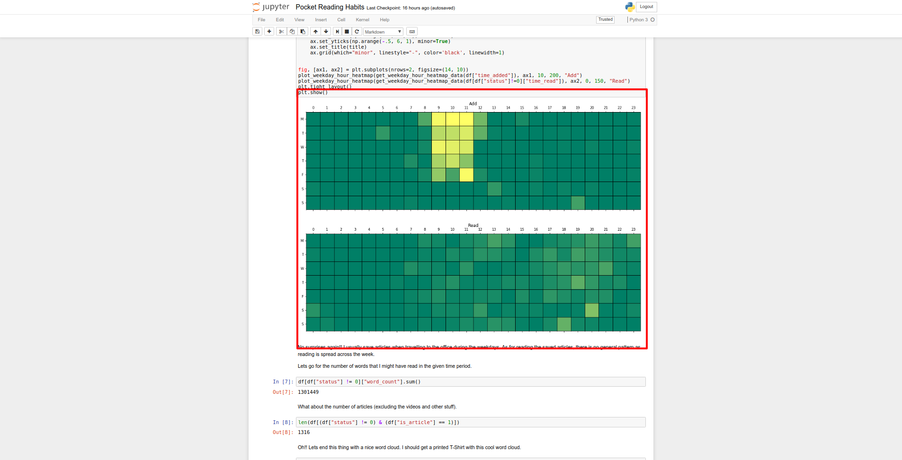

## Introduction

This is a simple script analyzing reading habits of a person using [Pocket](https://getpocket.com) API. Please generate required consumer key [Consumer Key](https://getpocket.com/developer/apps/new) for using Pokcet API. Access Token can be generated using the API or [fxneumann's OneClickPocket](https://reader.fxneumann.de/plugins/oneclickpocket/auth.php).

The analysis includes top websites a person visits for reading. When he/she is most active and what are most common things they read about. Here is a sample calendar heatmap similar to one present on github.

     

